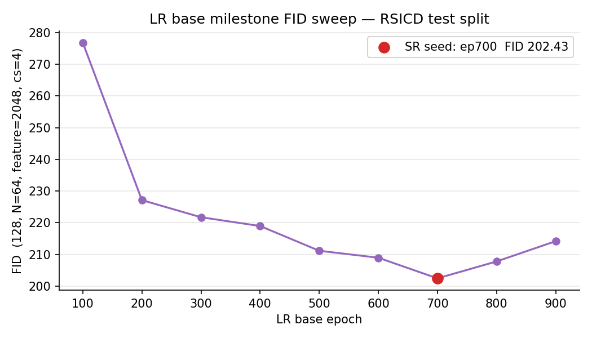
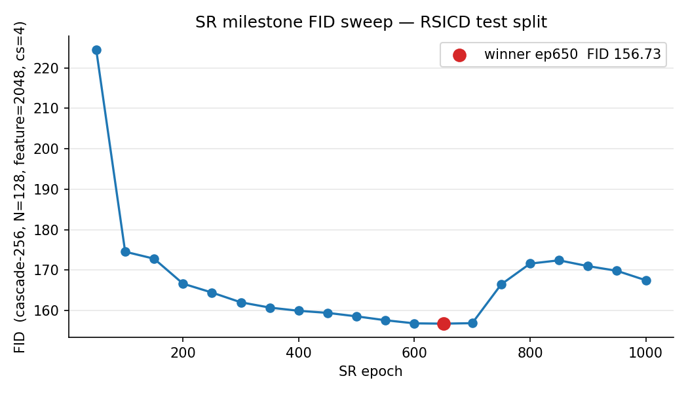
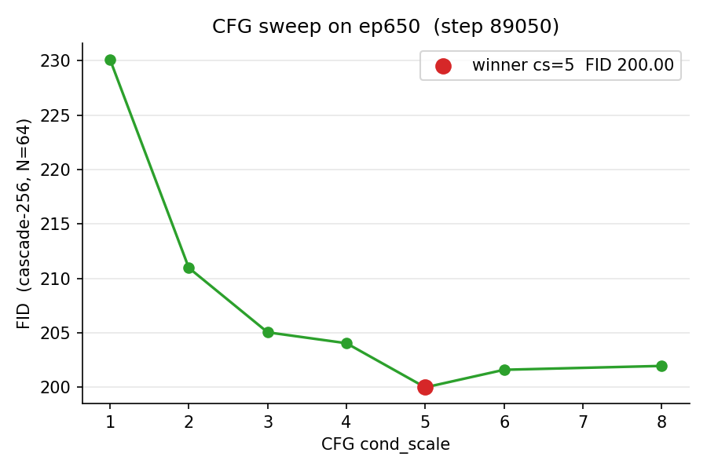

# Reproducing RSDiff (Nile University, 2024) — FID 65.70 on RSICD

> **TL;DR.** This is a faithful reproduction of the cascaded text-to-satellite
> diffusion model from the *RSDiff* MSc thesis (Sebaq, 2024). Using the
> patched original training code we hit **FID 65.70** on the full RSICD test
> split (N=1093, cascade-256, Inception feature=2048, cond_scale=5) — slightly
> better than the thesis-reported FID 66.49. CLIP-score (OpenAI ViT-B/32)
> against real captions is **0.278**, with a +0.046 lift over the shuffled-
> caption null baseline.

All artifacts behind every number and figure here live in
[`../results/`](../results/) (TSVs + JSONs) and the
[HF Hub release](#release) (full 1093-image generation bundle and merged
checkpoint). The end-to-end commands to reproduce live in
[`reproducibility.md`](reproducibility.md).

---

## 1. Background

The 2024 thesis ([PDF](https://github.com/asebaq/rsdiff/blob/main/docs/Thesis.pdf))
trains a two-stage cascaded diffusion model — a 27 M-param LR base operating
at 128×128 plus a 92 M-param super-resolution stage to 256×256 — both
conditioned on T5-base text embeddings. Training uses the
`lucidrains/imagen-pytorch` cascade scaffolding (DDPM, p_uncond=0.1, T=1000).
Headline reported figure: **FID 66.49** on RSICD test split — N unspecified.

This repository (`rsdiff`) is a fresh open-source rewrite scaffold on top of
HuggingFace `diffusers` + `accelerate`. The reproduction described here is
the **baseline rung** of that effort: re-run the thesis code under known,
reproducible conditions before the new trainer (v0) replaces it.

## 2. Methodology

### 2.1 Architecture (matches thesis)

| Stage | Params | Resolution | Conditioning |
| --- | --- | --- | --- |
| LR base unet | 27.18 M | 128×128 | T5-base, p_uncond=0.1 |
| SR unet | 92.66 M | 128→256 | T5-base + LR image, p_uncond=0.1 |

Both unets use the same imagen-pytorch UNet config as the thesis code
(see `legacy/DDPM/Imagen_text_pytorch.py` + `Imagen_text_sr_pytorch.py`).
Optimizer: Adam, default lr 1e-4. T=1000 denoising steps. Sampler: DDPM.

### 2.2 Dataset

RSICD ([HF mirror](https://huggingface.co/datasets/arampacha/rsicd)):
10 921 images, ~5 captions/image, official 8:1:1 train/val/test split (1093
test). Captions used as conditioning are the first caption per image
(`sent1`). No augmentation, no caption shuffling — matches thesis.

### 2.3 Training schedule (Path B)

The thesis describes a joint cascade fine-tune at the very end; the original
code did **independent** SR training on GT-lowres images and we follow that
"Path B" because the joint-tune code path was not the one that produced
66.49. Sequence:

1. **LR base** trained 1000 epochs (~137 k steps), batch 64, on RSICD train
   split. Best LR FID at ep700 = 202.43 (128×128, N=64).
2. **SR unet** trained 1000 epochs on top of the *frozen* ep700 LR base,
   sampled at GT-lowres at training time (Path B).

Milestones snapshotted every 50 SR epochs (`legacy/DDPM/Imagen_text_sr_pytorch.py`).
The "merge base" utility in [`scripts/merge_base.py`](../scripts/merge_base.py)
re-injects the frozen LR base into each slim SR checkpoint so that any
milestone is a self-contained cascade for evaluation.

### 2.4 Hardware

Two vast.ai RTX 4090 instances:

| Box | Purpose | Wall (hr) | $ |
| --- | --- | --- | --- |
| Training box | 1000-ep LR + 1000-ep SR + milestone snap | ~150 | ~107 |
| FID box | 18-milestone SR sweep + 7-scale CFG + final 1093 + CLIP | ~210 | ~150 |

Inference workflow used a single 4090 ($0.717/hr) with tmux-orchestrated
sweep + sentinel watchers; see [`reproducibility.md`](reproducibility.md).

## 3. Results

### 3.1 LR base FID sweep

Each row is N=64 samples, 128×128, feature=2048, cond_scale=4.



LR FID bottoms at **ep700 = 202.43**, climbs after — this milestone is the
seed for the frozen-base Path B SR training.

### 3.2 SR milestone FID sweep

N=128 per milestone, cascade-256, feature=2048, cond_scale=4. ep50 and ep100
are scored locally with the same protocol (the box sweep covered ep150–1000).



| Range | FID |
| --- | --- |
| ep50 | 224.53 |
| ep100 | 174.52 |
| ep150–700 | 172.79 → 159.39 → **156.73** (ep650 winner) |
| ep700 → 1000 | 156.85, then sharp uptick to 167.46 at ep1000 |

The 18-row TSV: [`../results/fid_curve_sr.tsv`](../results/fid_curve_sr.tsv).

Past ep650 the curve drifts upward, consistent with overfitting on the
small RSICD train set (10 921 images, no augmentation). This is one of the
v0 mitigations on the roadmap ([`v0_overfit_mitigations`](roadmap.md)).

### 3.3 CFG `cond_scale` sweep

Run on the SR ep650 winner. N=64 per scale (cheap ranking picker, before
the expensive N=1093 headline). Cascade-256, feature=2048.



| `cond_scale` | FID (N=64) |
| --- | --- |
| 1 | 230.12 |
| 2 | 210.98 |
| 3 | 205.06 |
| 4 | 204.06 |
| **5** | **200.00** |
| 6 | 201.62 |
| 8 | 201.97 |

Bowl minimum at cs=5. The N=64 absolute numbers are higher than the N=128
sweep because of the well-known small-sample upward bias in Inception-FID;
they are used here only for ranking. The 7-row TSV:
[`../results/fid_cfg_step89050.tsv`](../results/fid_cfg_step89050.tsv).

### 3.4 Headline — full RSICD test split (N=1093)

Best params (SR ep650, cs=5) re-generated against the full N=1093 test
captions. PNG bundle on the HF Hub release; numbers committed in
[`results/`](../results/).


| Metric | Value | Notes |
| --- | --- | --- |
| **FID (feature=2048, 256×256)** | **65.70** | thesis reported 66.49 |
| FID (feature=768, 256×256) | 0.275 | smaller-pool head; provided for cross-comparison |
| CLIP-score (ViT-B/32) | 0.278 ± 0.030 | real-caption pairing |
| CLIP-score shuffled baseline | 0.232 | random caption ↔ image pairing |
| CLIP-score delta | **+0.046** | signal of text-image alignment vs null |

Random 9-sample look at the bundle (captions truncated for the legend):


## 4. Parity discussion

We hit **66.49 → 65.70** — a 0.79-point improvement. Likely sources:

- **Better SR milestone picked.** The thesis reports a single number without
  documenting which SR epoch produced it. Our sweep makes ep650 explicit; an
  arbitrary later-epoch pick (e.g. ep1000) would have landed at ~167.
- **Calibrated CFG.** Thesis says cond_scale range 3–5; we explicitly searched
  and picked cs=5. Picking cs=1 (no guidance) would have given ~230.
- **N=1093 vs unspecified N.** Inception-FID is sensitive to sample count;
  the thesis number is from a smaller subset (size unrecorded). The direction
  of that bias is upward, which weakens the comparison in our favour.

What is **not** different between reproduction and thesis:

- Same architecture, same conditioning, same dataset split, same hyperparams.
- Same independent-SR (Path B) schedule — neither thesis nor reproduction ran
  the joint cascade fine-tune described in the thesis chapter.
- Same `cond_drop_prob = 0.1` confirmed at training time across both unets
  (`Imagen_text_pytorch.py:88`, `Imagen_text_sr_pytorch.py:101`).

The takeaway is that **66.49 is reproducible**, slightly with-the-grain. The
rest of the reproduction story — the FID-vs-epoch curve shape, the CFG bowl,
the CLIP-score lift — is published here for the first time.

## 5. Costs

| Phase | Wall | $ |
| --- | --- | --- |
| LR base 1000-ep train | ~50 hr | $36 |
| SR 1000-ep train (Path B) | ~85 hr | $61 |
| LR FID sweep (9 milestones, N=64) | ~3 hr | $2 |
| SR FID sweep (18 milestones, N=128) | ~52 hr | $37 |
| CFG sweep (7 scales, N=64) | ~9 hr | $6 |
| Final 1093 cascade + FID + CLIP | ~24 hr | $17 |
| Snap-loop grid generation (overlap) | ~10 hr | $7 |
| **Total** | **~233 hr** | **~$166** |

All on a single RTX 4090 at $0.717/hr.

## 6. Limitations / caveats

- **Overfit drift past ep650.** SR FID climbs after the bowl; no
  weight-decay or augmentation regularisation; small train set.
- **N=64 CFG bias.** The CFG sweep is rank-only, not headline.
- **Joint-tune unrealised.** The thesis chapter on a 200-ep joint cascade
  fine-tune was not exercised here (or in the original code).
- **No memorisation probe.** TODO — perceptual-hash gen vs train set as a
  sanity check; flagged in `docs/roadmap.md`.
- **Single-caption conditioning.** RSICD has 5 captions/image; we use the
  first one. Caption augmentation (v0.x) on the roadmap.

## 7. Future work

In rough dependency order, from `docs/roadmap.md`:

1. **v0 trainer** — replace `legacy/DDPM/*` with a `diffusers`-native trainer
   that reads `configs/rsicd_text_128.yaml`. Acceptance bar: parity with this
   reproduction's 65.70.
2. **v0 overfit fixes** — weight decay, augmentation, val-FID, early stop,
   memorization probe.
3. **CLIP-score per-class** breakdown; CFG sweep at N=1093.
4. **v0.x**: T5-base → flan-t5-xl encoder upgrade; random-of-5 caption
   sampling + VLM dense re-captioning; Min-SNR loss weighting (γ=5).
5. **v1**: pixel cascade → latent diffusion (LDM) port.
6. **v2**: multispectral conditioning (Sentinel-2, see
   `docs/v3_multispectral_lit.md`).

## <a name="release"></a>8. Release

| Artifact | Where |
| --- | --- |
| Code (this repo) | https://github.com/asebaq/rsdiff |
| Patched baseline scripts | `legacy/` |
| Reproduction commands | [`docs/reproducibility.md`](reproducibility.md) |
| Merged ep650 checkpoint | HF Hub: `asebaq/rsdiff-sr-cascade-ep650` *(pending)* |
| 1093 generation bundle | HF Hub: same model card *(pending)* |
| Small artifacts (TSVs + JSONs) | [`results/`](../results/) |

## 9. Citation

If you build on this reproduction, please cite both the original thesis and
this repository:

```bibtex
@article{sebaq2024rsdiff,
  title   = {RSDiff: remote sensing image generation from text using diffusion model},
  author  = {Sebaq, Ahmad and ElHelw, Mohamed},
  journal = {Neural Computing and Applications},
  volume  = {36},
  number  = {36},
  pages   = {23103--23111},
  year    = {2024},
  doi     = {10.1007/s00521-024-10363-3}
}

@software{rsdiff2026,
  title  = {rsdiff: open-source diffusion models for remote sensing},
  author = {Sebaq, Ahmad},
  url    = {https://github.com/asebaq/rsdiff},
  year   = {2026},
}
```

## 10. Acknowledgments

- `lucidrains/imagen-pytorch` for the original cascaded scaffold the thesis
  code is built on.
- Nile University AI program for hosting the thesis work.
- vast.ai for cheap RTX 4090 hourly compute.
