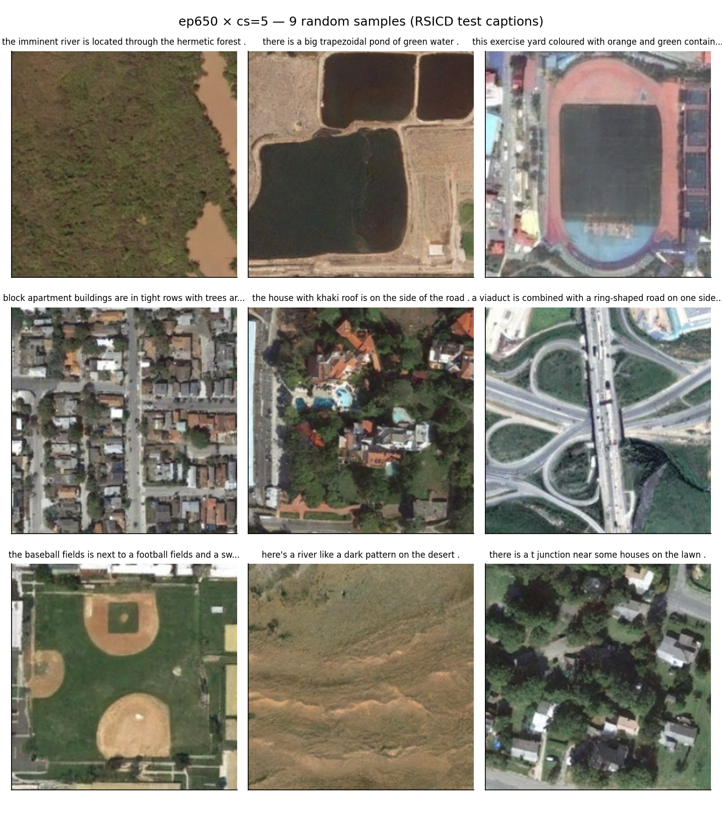
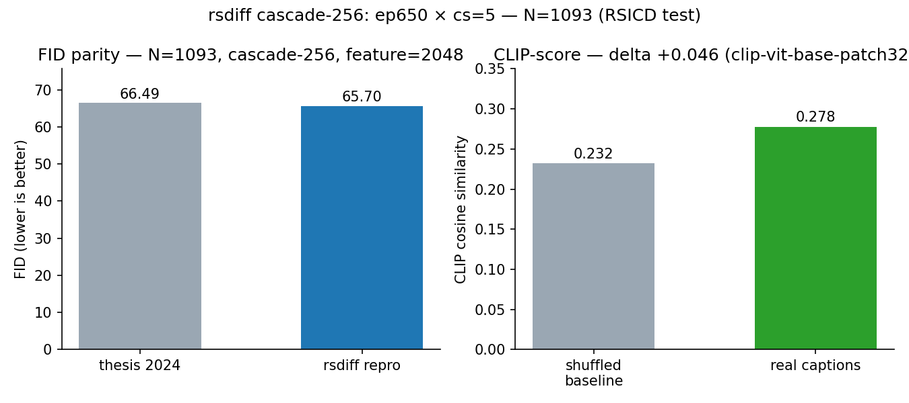

# RSDiff: Remote Sensing Image Generation from Text

[](https://doi.org/10.1007/s00521-024-10363-3)
[](https://huggingface.co/asebaq/rsdiff-sr-cascade-ep650)
[](https://github.com/asebaq/rsdiff)
[](https://github.com/asebaq/rsdiff/blob/main/LICENSE)

<p align="center">
  
</p>

> **RSDiff: Remote Sensing Image Generation from Text Using Diffusion Model**
> [Ahmad Sebaq](https://github.com/asebaq), Mohamed ElHelw
> Center for Informatics Science, Nile University
> *Neural Computing and Applications*, 2024
> [[Paper](https://doi.org/10.1007/s00521-024-10363-3)] · [[Code](https://github.com/asebaq/rsdiff)] · [[Model](https://huggingface.co/asebaq/rsdiff-sr-cascade-ep650)]

A T5-conditioned cascaded diffusion model for text-to-satellite-image generation at 256×256, trained on RSICD. The released checkpoint reaches **FID 65.70** and **CLIP-score 0.278** on the full RSICD test split (N=1,093, `cond_scale=5`).

<div class="grid cards" markdown>

-   :material-image-multiple:{ .lg .middle } __Text-conditioned__

    ---

    Frozen T5-base text encoder drives both UNets via cross-attention.
    Classifier-free guidance scales caption adherence at inference time.

-   :material-cube-outline:{ .lg .middle } __Cascaded LR + SR__

    ---

    27 M-param 128² base UNet feeds a 92 M-param super-resolution UNet
    to 256². 120 M parameters total. 1000-step DDPM.

-   :material-chart-line:{ .lg .middle } __FID 65.70, CLIP 0.278__

    ---

    Full RSICD test split (N=1,093) at Inception feature=2048. CLIP-score
    lift +0.046 over a shuffled-caption null baseline.

-   :material-package-variant:{ .lg .middle } __Open weights__

    ---

    Pretrained cascade released on the HuggingFace Hub at
    `asebaq/rsdiff-sr-cascade-ep650`. Apache 2.0 licensed.

</div>

## Headline

<p align="center">
  
</p>

| Metric | Value |
|---|---|
| **FID** (cascade-256, N=1093, feature=2048) | **65.70** |
| **CLIP-score** (OpenAI ViT-B/32) | **0.278** ± 0.030 |
| CLIP-score (shuffled-caption null) | 0.232 |
| CLIP-score delta vs null | **+0.046** |

See [Results](results.md) for the full FID-vs-epoch sweep, CFG-scale ablation, and discussion.

## Quick start

```bash
git clone https://github.com/asebaq/rsdiff && cd rsdiff
uv venv && source .venv/bin/activate
uv pip install -e ".[dev,eval]"

# pull the released cascade
hf download asebaq/rsdiff-sr-cascade-ep650 ckpt_sr_ep650_step89050.pt -o ddpm/ckpts/

# sample 16 captions from the RSICD test split
python ddpm/sample_grid.py \
  --log_dir ddpm/logs/full_sr_gdm \
  --data_root data/RSICD_optimal \
  --ckpt ddpm/ckpts/ckpt_sr_ep650_step89050.pt \
  --n 16 --cols 4 --batch 2 --cond_scale 5.0 \
  --img_sz 128 --sr_sz 256 --ts 1000 \
  --sr --split test --seed 17
```

Full installation, training, and evaluation runbook on the [Usage](usage.md) page.

## Acknowledgments

Built on `lucidrains/imagen-pytorch` for the cascade scaffolding and the HuggingFace `datasets` mirror of RSICD. Developed at the Center for Informatics Science, Nile University.
