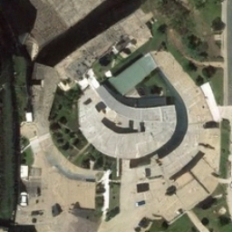
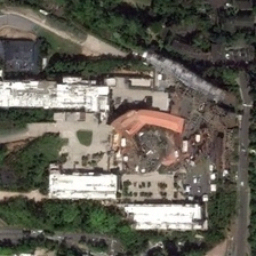
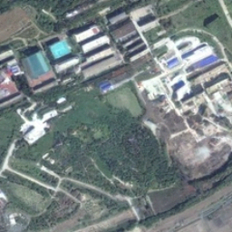
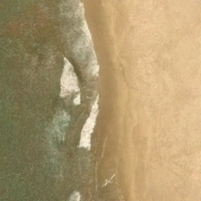
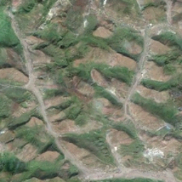
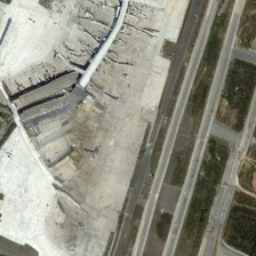
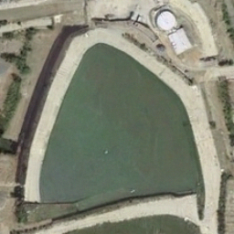
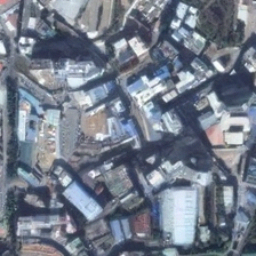
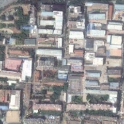

# RSDiff: Remote Sensing Image Generation from Text

> **RSDiff: Remote Sensing Image Generation from Text Using Diffusion Model**
> [Ahmad Sebaq](https://github.com/asebaq), Mohamed ElHelw
> Center for Informatics Science, Nile University
> *Neural Computing and Applications*, 2024
> [[Paper](https://doi.org/10.1007/s00521-024-10363-3)] · [[Code](https://github.com/asebaq/rsdiff)] · [[Model](https://huggingface.co/asebaq/rsdiff-sr-cascade-ep650)]

A T5-conditioned cascaded diffusion model for text-to-satellite-image generation at 256×256, trained on RSICD. The released checkpoint reaches **FID 65.70** and **CLIP-score 0.278** on the full RSICD test split (N=1,093, `cond_scale=5`).

-   :material-image-multiple:{ .lg .middle } __Text-conditioned__

    ---

    Frozen T5-base text encoder drives both UNets via cross-attention.
    Classifier-free guidance scales caption adherence at inference time.

-   :material-cube-outline:{ .lg .middle } __Cascaded LR + SR__

    ---

    27 M-param 128² base UNet feeds a 92 M-param super-resolution UNet
    to 256². 120 M parameters total. 1000-step DDPM.

-   :material-chart-line:{ .lg .middle } __FID 65.70, CLIP 0.278__

    ---

    Full RSICD test split (N=1,093) at Inception feature=2048. CLIP-score
    lift +0.046 over a shuffled-caption null baseline.

-   :material-package-variant:{ .lg .middle } __Open weights__

    ---

    Pretrained cascade released on the HuggingFace Hub at
    `asebaq/rsdiff-sr-cascade-ep650`. Apache 2.0 licensed.

## Headline

  

| Metric | Value |
|---|---|
| **FID** (cascade-256, N=1093, feature=2048) | **65.70** |
| **CLIP-score** (OpenAI ViT-B/32) | **0.278** ± 0.030 |
| CLIP-score (shuffled-caption null) | 0.232 |
| CLIP-score delta vs null | **+0.046** |

See [Results](results.md) for the full FID-vs-epoch sweep, CFG-scale ablation, and discussion.

## Samples

Nine 256×256 samples from the RSICD test split, generated with the released cascade at `cond_scale=5`. Captions shown verbatim — no truncation.

<figure markdown>
  { width="100%" }
  <figcaption>"there's a green pool like an airplane closing the house with a grey roof ."</figcaption>
</figure>

<figure markdown>
  { width="100%" }
  <figcaption>"there are many large trees on both sides of the wide road ."</figcaption>
</figure>

<figure markdown>
  { width="100%" }
  <figcaption>"the lake cover the most area of the lake ."</figcaption>
</figure>

<figure markdown>
  { width="100%" }
  <figcaption>"the waves are crushing on the wet sand ."</figcaption>
</figure>

<figure markdown>
  { width="100%" }
  <figcaption>"roads and rivers can be seen in the valleys ."</figcaption>
</figure>

<figure markdown>
  { width="100%" }
  <figcaption>"the airport covers a large area and has many planes ."</figcaption>
</figure>

<figure markdown>
  { width="100%" }
  <figcaption>"the rectangular pond close to the trapezoidal pond is next to a building with a parking lot surrounded by trees ."</figcaption>
</figure>

<figure markdown>
  { width="100%" }
  <figcaption>"some streets divide advertising into several pieces ."</figcaption>
</figure>

<figure markdown>
  { width="100%" }
  <figcaption>"white advertising with surrounding trees is next to a main road and some apartments ."</figcaption>
</figure>

Full 1,093-image generation bundle on the [HF Hub release](https://huggingface.co/asebaq/rsdiff-sr-cascade-ep650) under `samples/`.

## Acknowledgments

Built on `lucidrains/imagen-pytorch` for the cascade scaffolding and the HuggingFace `datasets` mirror of RSICD. Developed at the Center for Informatics Science, Nile University.
